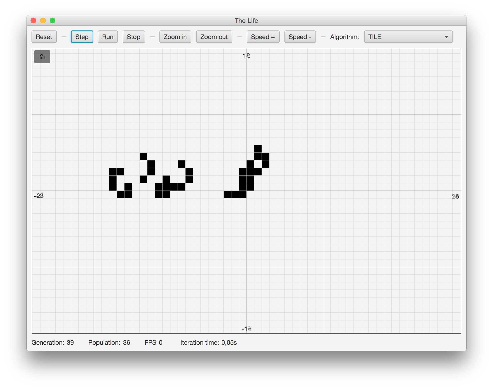

# TheLife
Conway's Life simulator and explorer
[Wikipedia](https://en.wikipedia.org/wiki/Conway%27s_Game_of_Life)

Experiments with different algorithms and their performance. 

Implemented algorithms: 

* POINT
   
    Quite simple algorithm. Just set of points with alive cells. 
    On each iteration neighbors of every alive cell is checked if 
    cell should be born or die there.

* TILE

    Field is represented as a set of "tiles". Tile holds information 
    if there is life in a center and number of alive neighbors.
    So in each iteration it can be decided if cell in the center 
    should born or die just by checking number of alive neighbors.
    If cell in the center of a tile is born/died then 
    number of alive neighbors in all overlapping tiles is 
    increased/decreased.  
    
* TILE_V2

    Performance improvement to TILE algorithms. On next iteration 
    only tiles that were touched on previous are checked.
      
* CACHED_QUAD_TREE

    Implementation of Hashlife (Cached Quad Tree) algorithm.
    Gives incredible speed of simulation if there are more or less 
    repeatable patterns. 
    [Explanation of the algorithm](http://www.drdobbs.com/jvm/an-algorithm-for-compressing-space-and-t/184406478).
    

